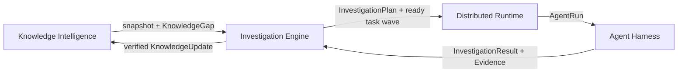

# Autonomous Investigation Engine

Phase 4 adds the intelligence layer between the existing knowledge engine and the
existing distributed AgentRun runtime. It does not replace retrieval, GraphRAG, gap
analysis, the Agent Harness, task leases, retries, or worker scheduling.



## Public domain model

- `ResearchObjective` records the question, scope, constraints, success criteria,
  metadata, identifier, and creation time.
- `InvestigationSession` is an explicit `PLANNING → EXECUTING → EVALUATING →
  UPDATING` state machine with paused and terminal states.
- `KnowledgeSnapshot` captures retrieval references, GraphRAG entities and relations,
  gaps, contradiction keys, uncertainty, and observation metadata.
- `CandidateInvestigation` is a deterministic transformation of a measurable gap. It
  records the hypothesis, evidence need, capability requirements, gain, cost, time,
  risk, and priority.
- `InvestigationPlan` validates dependencies and compiles through the existing
  `TaskDAG` and distributed task contracts.
- `Evidence`, `Evaluation`, `VerificationReport`, `InvestigationKnowledgeUpdate`, and
  `ProgressReport` make the epistemic result inspectable rather than concatenating
  agent text.

All identifiers and important state are serializable. `SQLiteInvestigationRepository`
persists the objective, session, iteration, and ordered artifacts. A process restart
can reload collected `InvestigationResult` and `EvidenceSet` values and continue
evaluation without rerunning completed agents.

## Application boundary

`InvestigationApplication` exposes independently callable stages:

1. `observe`
2. `generate`
3. `score`
4. `select`
5. `build_plan`
6. `start_execution` / `advance_execution`
7. `collect_evidence`
8. `evaluate`
9. `verify`
10. `update_knowledge`
11. `finish_iteration`

`plan_iteration` and `process_results` are thin compositions of those services. They
do not hide an unbounded research loop.

The high-level CLI is also thin:

```text
nexus-research create QUESTION --criterion CRITERION
nexus-research status SESSION_ID
nexus-research pause SESSION_ID
nexus-research resume SESSION_ID
nexus-research cancel SESSION_ID
nexus-research explain SESSION_ID
nexus-research evidence SESSION_ID
nexus-research gaps SESSION_ID
nexus-research plan SESSION_ID
nexus-research iterations SESSION_ID
```

## Execution contract

The current distributed record intentionally has no dependency field. The
investigation layer therefore submits only dependency-ready waves. It never assigns a
worker, claims a lease, retries an attempt, or executes an agent. When a parent task
succeeds, `PlanExecutionController` submits newly ready children through
`RuntimeApplication`. A cancelled or dead-lettered parent marks descendants blocked
in the persisted plan execution rather than pretending they ran.

The first wave can contain many independent tasks, allowing the existing scheduler to
place them concurrently according to required capabilities.

## Explainability and observability

`explain` reconstructs three decision chains:

- gap → gain/importance/uncertainty/cost/risk → score → selection;
- claim → evidence → source lineage → evaluation → verification;
- termination reason → objective confidence → gaps → contradictions → budget.

Structured events use the `investigation.*` namespace and preserve objective/session
correlation. Metrics include sessions, iterations, gaps discovered and resolved,
generated/executed investigations, evidence, contradictions, updates, information
gain, and cost per resolved gap.

Run the deterministic 10/50/10 baseline with:

```bash
nexus-investigation-bench
```

See [lifecycle](investigation-lifecycle.md), [planning](investigation-planning.md),
[evidence](evidence-model.md), [provenance](provenance.md),
[verification](verification.md), and [closed loop](autonomous-loop.md).
