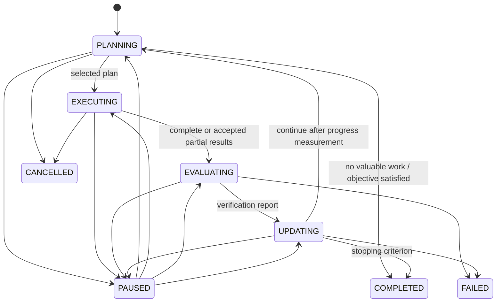
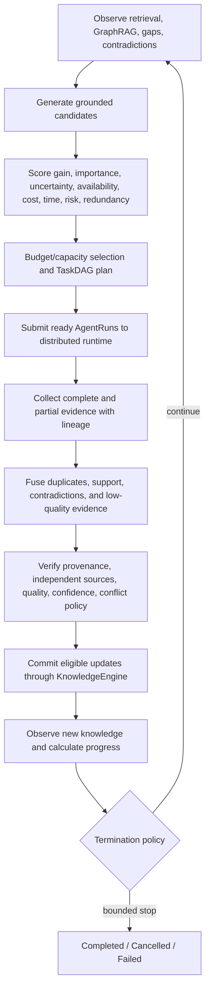

# Closed Epistemic Loop

The investigation engine advances one explicit stage at a time. There is no
`while True` research loop and no prompt that substitutes for control flow.

## One iteration

## Bounded termination

Every session has maximum iterations, investigations, AgentRuns, cost, and execution
time. The deterministic termination policy handles objective satisfaction, confidence,
budget exhaustion, maximum iterations, no valuable candidate, unresolvable conflict,
user cancellation, and system failure in a documented precedence order.

An uncertain result is valid. Verification preserves `confirmed`, `probable`,
`uncertain`, `contradicted`, and `insufficient_evidence`; only policy-eligible claims
reach the knowledge-update boundary.

## Partial results and failure

Distributed retry and lease recovery stay in the coordinator. The investigation layer
sees the eventual task state and can evaluate completed or partial
`InvestigationResult` values while other tasks remain running. Failed dependencies are
recorded as blocked investigations. They are not silently counted as success.

Collected results are persisted before evaluation. After restart,
`resume_collected_iteration` reloads the evidence, continues evaluation and update, and
does not invoke the Agent Harness again. At-least-once distributed execution can still
duplicate delivery; evidence fingerprints and stable result lineage make fusion
idempotent and inspectable.

`resume_iteration` also reconstructs sessions interrupted during `EVALUATING` or
`UPDATING`. The update proposal is persisted before calling the knowledge service. If
the process fails after that call but before the receipt is stored, recovery may submit
the same proposal again. Claim and evidence identifiers remain stable, so repository
adapters must provide idempotent save-by-ID behavior. This is an explicit at-least-once
knowledge-update boundary; the application does not claim a distributed transaction
across its SQLite record and an external knowledge store.

## Progress

`ProgressMeasurer` compares before/after gap and contradiction snapshots and reports:

- gaps resolved, remaining, and newly discovered;
- uncertainty reduced;
- contradictions introduced and resolved;
- evidence and updates;
- information gain;
- cost per resolved gap.

This report is the input to the next stopping decision and is persisted with the full
iteration history.
