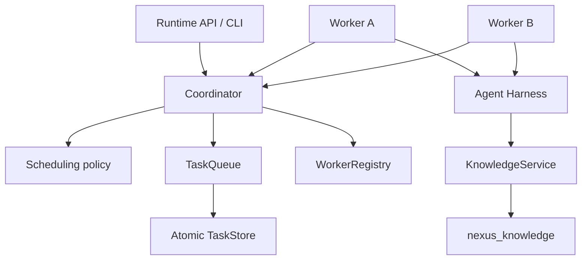

# Distributed runtime architecture

The distributed runtime decides **where, when, and by which worker** an existing
AgentRun executes. It does not implement the agent loop and does not access knowledge
storage. Workers call the harness by `run_id`; the harness alone owns model calls,
tools, policy, context, budgets, checkpoints, and replay.

## Ownership

- The coordinator owns task lifecycle, leases, retries, recovery, cancellation routing,
  worker registration, and metrics. It never executes an AgentRun.
- The scheduler is a pure policy: it selects an eligible task for a worker using
  availability, capabilities, priority, aging, and capacity.
- TaskQueue is the delivery port. Atomic mutation lives in TaskStore, so multiple
  coordinator/worker threads cannot successfully claim one task lease.
- A worker registers an externally supplied identity, heartbeats, claims one available
  slot, loads the referenced AgentRun through the harness port, reports the result, and
  releases capacity. It contains no model/tool/context logic.
- WorkerRegistry tracks liveness and capacity. TaskStore is durable task truth. Worker
  state may be rebuilt by re-registration after coordinator restart.

## Configuration

`RuntimeConfig` centralizes lease duration, heartbeat interval, worker failure
threshold, queue bound, and scheduling aging. Tests use a manually advanced clock;
production uses UTC system time.

## Coordination and persistence

The local durable backend is SQLite. Every ownership-sensitive operation runs inside a
`BEGIN IMMEDIATE` transaction: claim, start, renew, complete, fail, cancel, and expired
lease recovery. The in-memory backend uses the same interface and an `RLock` for the
deterministic simulator. These mechanisms establish atomicity only for one store, not
distributed consensus.

Task leases and harness checkpoints are distinct. A lease protects temporary ownership
of a distributed task. A checkpoint protects progress inside its AgentRun. After a
worker crash, a replacement receives a new attempt and lease, then asks the harness to
resume the same `run_id` from its durable checkpoint.

## Guarantees and non-guarantees

Delivery is **at least once**. The first valid completion committed under the current
lease wins. A worker may finish execution and lose its ACK; after lease expiry another
attempt may execute. Harness tools and external side effects therefore require stable
idempotency keys derived from task/run identity.

This runtime does **not** guarantee exactly-once execution, linearizability across
services, consensus, transactional execution spanning TaskStore and external systems,
global event ordering, or recovery of in-memory worker registrations. SQLite is a
single-node development backend, not a multi-region coordination database.

See [task lifecycle](task-lifecycle.md), [leases](leases.md), [retries](retries.md),
[workers](worker-model.md), [scheduling](scheduling.md), and
[failure recovery](failure-recovery.md).
