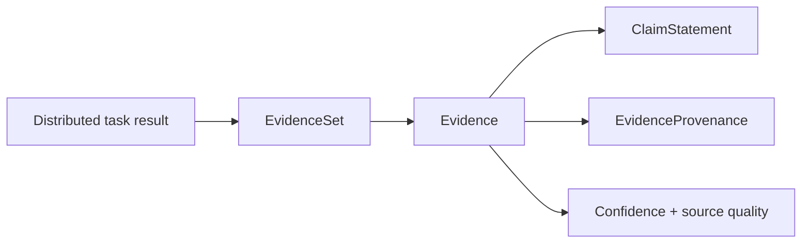

# Investigation evidence model

Investigation evidence is a first-class, immutable domain record. It is not an agent
response string. Each `Evidence` item contains a structured `ClaimStatement`, source
reference, excerpt or structured payload, confidence, source quality, epistemic role,
timestamp, supporting entities, metadata, and complete execution provenance.

`EvidenceSet` may combine completed results from several investigations in one session.
`InvestigationResult` represents the result from one task attempt and validates that
its investigation, task, attempt, and AgentRun identifiers match every evidence item.
This supports partial completion without treating failed tasks as successful.

## Fusion and classification

`EvidenceFusion` uses structured `(subject, predicate, object)` identities. Evidence
with the same assertion, source, excerpt/payload, and role is duplicate evidence.
Matching assertions from different sources remain independent corroboration.

Assertions with the same subject and predicate but different objects become explicit
`EvidenceConflict` records. Both claims and all supporting evidence remain present.
The conflict kind uses the existing knowledge subsystem's
`ContradictionKind.CONFLICTING_CLAIMS` vocabulary. No confidence-based winner is
chosen.

`EvidenceEvaluator` produces a structured `Evaluation` that separates:

- acceptable supporting, contradicting, and neutral evidence;
- duplicate evidence;
- low-confidence or low-source-quality evidence;
- unresolved structured conflicts.

The quality thresholds are policy values. Fusion and evaluation are deterministic for
the same input ordering and content.

## Track boundary

Track A and the distributed runtime communicate with this layer through explicit
string correlation identifiers and serialized domain records. Track B does not import
Track A planner/session implementations, allocate workers, retry tasks, call models, or
access runtime coordination internals.
