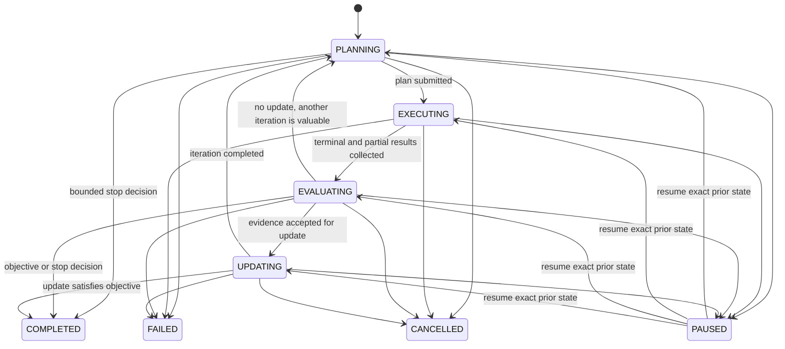

# Investigation lifecycle

An `InvestigationSession` is the inspectable, bounded lifecycle for one
`ResearchObjective`. The objective is provider-independent and records the question,
scope, constraints, success criteria, timestamp, metadata, and stable identifier.
Neither object contains a model, worker, scheduler, retrieval implementation, or
knowledge-store reference.

Every transition is validated. A paused session records its exact prior active state,
so resume cannot skip a stage. Terminal transitions require a `TerminationReason`;
active states cannot carry one. Iterations increment only when `UPDATING` explicitly
returns to `PLANNING`.

## Budgets and stopping

The session budget has five independent bounds: maximum iterations, investigations,
AgentRuns, cost, and execution time. Usage is explicit and serialized alongside the
session. Token accounting stays in the Agent Harness; this layer records only the
aggregate cost and run counts required for planning.

`TerminationPolicy` evaluates stop conditions in a stable precedence order:

1. user cancellation or non-recoverable system failure;
2. objective success or objective-confidence threshold;
3. maximum iterations or another exhausted budget dimension;
4. an unresolvable contradiction;
5. no candidate above the minimum value threshold.

A decision records the reason, target state, and human-readable explanation. Valuable
remaining work returns a non-terminal decision. There is no unbounded `while True`
condition hidden in the session.

## Persistence and recovery

Objectives, budgets, usage, and sessions expose JSON-compatible `to_dict`/`from_dict`
contracts. Timestamps must be timezone-aware. Session, objective, and correlation IDs
are values rather than Python object identities. An application can therefore persist
these records in its chosen store and reconstruct the iteration counter, paused state,
usage, and termination reason after restart.

Distributed task failure does not change this state machine directly. The distributed
runtime owns lease recovery and retries. The orchestration layer advances from
`EXECUTING` only after it has inspected the runtime's terminal and partial results; it
then decides whether remaining evidence is evaluable or substitute work is valuable.
