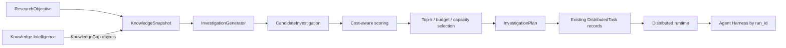

# Investigation planning

Track A transforms structured knowledge deficiencies into bounded work. It consumes
the existing `KnowledgeGap` and existing knowledge investigation scorer rather than
introducing another gap detector or retrieval stack.



## Observation and generation

`KnowledgeSnapshot` is a serializable planning record. It stores the objective query,
knowledge gap objects, mean uncertainty, retrieval references, graph entity/relation
IDs, contradiction IDs, and an observation summary. It does not execute retrieval,
GraphRAG, uncertainty analysis, or contradiction detection; the knowledge service
provides those results.

`InvestigationGenerator` enriches each gap's existing candidate investigations with:

- an evidence-seeking question and explicit hypothesis;
- required evidence and objective constraints;
- expected information gain and uncertainty reduction from the existing gain
  estimator;
- estimated cost, duration, risk, priority, target entities, and scheduler
  capabilities;
- deterministic content-derived IDs and correlation metadata.

Identical evidence needs are collapsed deterministically. No random agent spawning or
opaque model decision is part of generation.

## Scoring and selection

The scorer calls the existing knowledge `InvestigationScorer`, normalizes that signal,
and combines it with bounded components:

```text
benefit = information gain + gap importance + uncertainty reduction
        + evidence availability + priority + existing knowledge score

penalty = normalized cost + normalized duration + risk + redundancy

score = clamp(benefit - penalty, 0, 1)
```

Each term has an explicit configurable weight. A score includes all components and a
rationale, allowing an explanation to trace gap, gain, importance, cost, risk, and
selection outcome. `InformationGainForecast` records expected gain, expected
uncertainty reduction, estimated cost, and gain per cost. Actual before/after progress
belongs to the evidence/knowledge loop.

Selection sorts deterministically by score and ID, then enforces top-k, available
worker capacity, remaining investigations, remaining AgentRuns, remaining cost, and
execution-time capacity. A redundancy key prevents duplicate evidence needs from
occupying multiple slots. Rejections retain a reason such as `cost_budget`,
`execution_time_budget`, `below_minimum_score`, or `redundant_evidence_need`.

## Plan and task contracts

An `InvestigationPlan` contains its plan/session IDs, selected candidate records,
dependency mapping, budget, and creation time. Construction rejects unknown nodes,
self-dependencies, duplicate IDs, and cycles. Independent investigations remain root
nodes and are therefore parallelizable.

The plan is compiled into distributed work only by the orchestration service:

- `PlanExecutionController` submits each investigation through
  `RuntimeApplication.submit_task` with the session correlation ID, the
  investigation's required capabilities and priority, and an explicit Agent
  Harness `run_id` supplied by the application;
- task metadata carries plan, investigation, gap, question, hypothesis, evidence
  requirements, constraints, and dependency investigation IDs.

The distributed runtime task record currently has no dependency field. The
integration/orchestration service must therefore submit only the dependency-ready
wave, then submit newly ready children after predecessor success. Dependencies are
retained in task metadata for reconstruction, but metadata does not bypass runtime
scheduling.
The runtime still owns assignment, leases, retries, cancellation, and recovery. The
worker still invokes the Agent Harness; planning never calls a model directly.

All objective, candidate, snapshot, score, selection, session, and plan decisions are
JSON-compatible or reconstructable from their serialized domain records. The caller
must persist those records and the existing runtime/harness stores under the shared
session, investigation, task, and run lineage.
