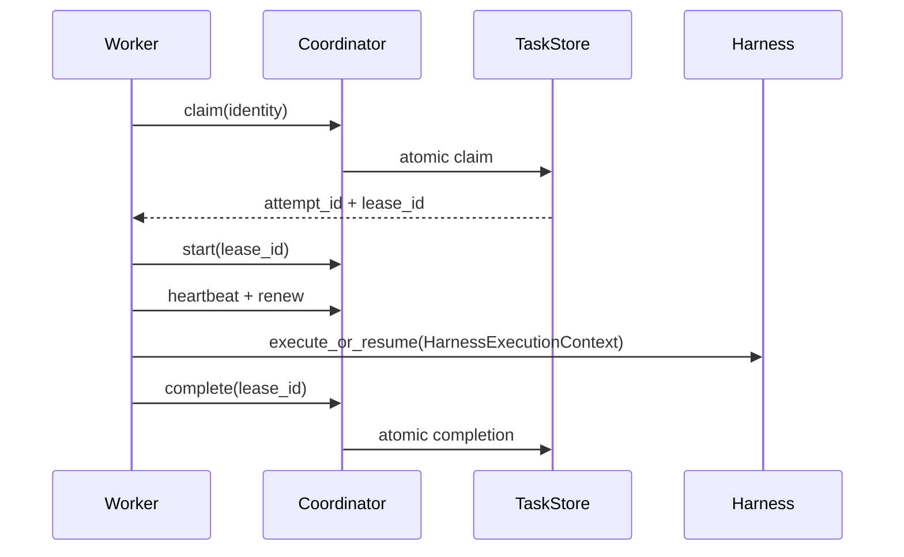

# Lease semantics

A lease is `{lease_id, task_id, worker_id, issued_at, expires_at}`. Claiming is atomic:
only a queued, available, non-expired task may become claimed, and one transaction
creates both its new attempt and lease. A worker must present matching worker and lease
IDs to start, renew, complete, fail, or acknowledge cancellation.

Heartbeats update worker `last_seen` and renew only leases still owned by that worker.
Renewal after expiry or with a stale lease is rejected. Missing heartbeats eventually
mark a worker unhealthy. Expired tasks are recovered independently, so losing the
in-memory worker registry cannot strand durable work.

Lease duration, heartbeat interval, and failure threshold are configuration values.
