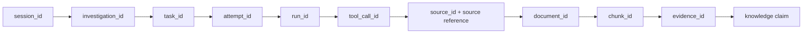

# Investigation provenance

Every evidence item must answer where it originated and how it was produced. The
required `EvidenceProvenance` chain is:

All identifiers are non-empty strings rather than object references. Construction
fails if any required correlation, source, document, or chunk identifier is absent.
The source reference stored on `Evidence` must equal the provenance source reference,
and the investigation identifier must match too.

This strictness deliberately rejects anonymous evidence early. It also makes lineage
serializable, durable, and reconstructable across process restarts. A knowledge update
copies every evidence lineage record into claim metadata while retaining the existing
knowledge subsystem's chunk, document, source, and evidence identifiers.

The knowledge update adapter never writes repositories or graph storage. It builds the
existing `KnowledgeUpdate` service contract and submits it with
`KnowledgeEngine.commit_knowledge_update`.
