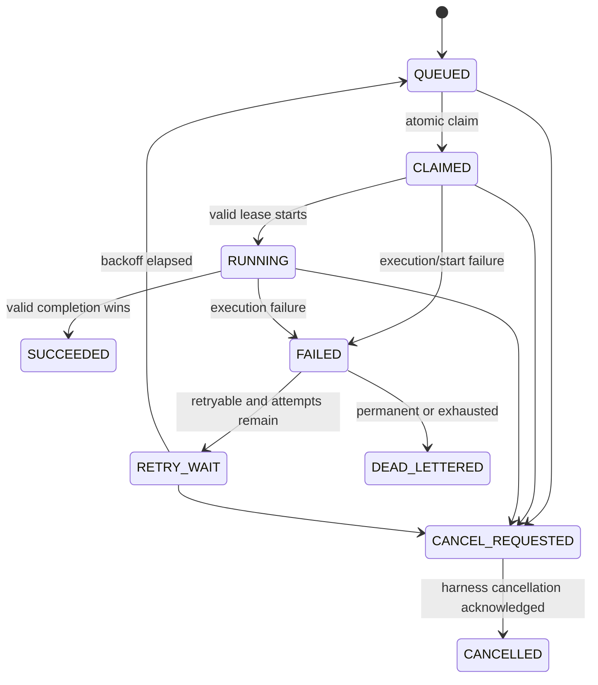

# Distributed task lifecycle

A distributed Task contains only scheduling data and a reference to an AgentRun:
`task_id`, `run_id`, correlation ID, priority, state, attempt count, worker/lease IDs,
timestamps, availability/deadline, retry policy, capability requirements, and validated
metadata. The AgentRun itself remains in the harness store.

Lease expiry follows the same failure accounting path and either enters `RETRY_WAIT` or
`DEAD_LETTERED`. Transitions are centralized and invalid edges raise a domain error.
Each attempt has a distinct `attempt_id`; each claim has a distinct `lease_id`.

The dead-letter record retains the task, attempt history, workers, errors, timestamps,
last checkpoint reference, and last known state for inspection and explicit retry.
