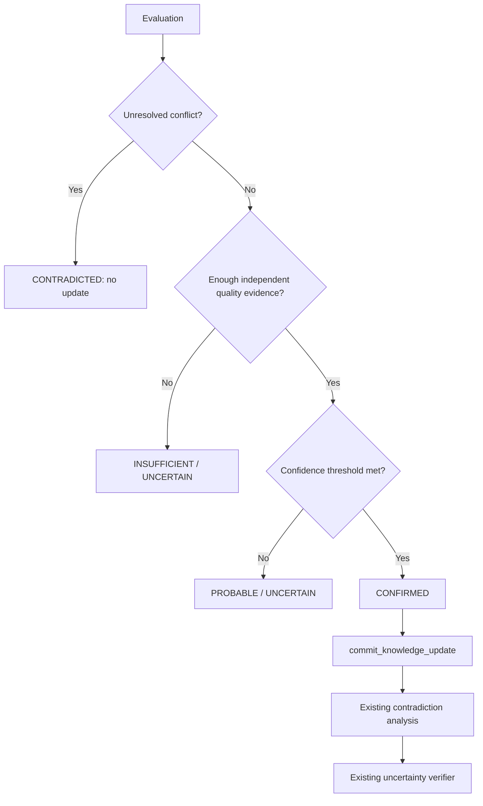

# Evidence verification and knowledge updates

Verification is a deterministic policy decision over an `Evaluation`. The default
policy requires:

- at least two independent sources;
- evidence confidence of at least `0.5`;
- source quality of at least `0.5`;
- aggregate claim confidence of at least `0.7`;
- complete provenance;
- no explicit contradicting evidence or unresolved conflict.

Thresholds and whether probable claims may be updated are configurable. Outcomes are
`confirmed`, `probable`, `uncertain`, `contradicted`, or `insufficient_evidence`.
Uncertain, contradicted, and insufficient claims are not silently promoted.

## Knowledge-service integration

Eligible claims are submitted as unverified claims with their evidence in one existing
`KnowledgeUpdate`. The integration then invokes the existing contradiction analyzer.
Any conflict involving a new claim remains unresolved and the claim is not advanced by
the verifier. Conflict-free claims pass through the existing public `verify_claim`
service. The integration never chooses the most confident agent and never accesses the
knowledge repositories directly.

The current knowledge service discovers contradictions by scanning committed claims;
there is no public preflight-candidate API. Submitting candidates initially as
unverified preserves that boundary and prevents a new conflict from becoming trusted.
Intra-batch conflicts are rejected earlier by evidence fusion.

## Progress

`ProgressMeasurer` compares explicit before/after gap and contradiction snapshots. A
`ProgressReport` records resolved, new, and remaining gaps; reduced uncertainty; new
and resolved contradictions; evidence and update counts; normalized information gain;
cost; and cost per resolved gap. New uncertainty and contradictions reduce measured
gain instead of being hidden.
